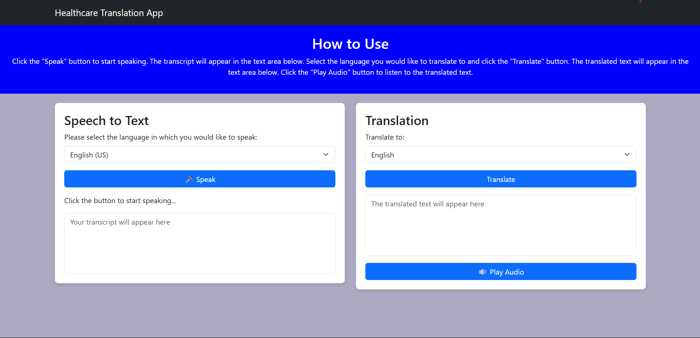

# Healthcare Translation App
A basic translation app intended for medical usage.
## About
The Healthcare Translation App is a web application that enables users to translate speech into multiple languages and provides audio output for the translated text. It is especially useful in healthcare scenarios where multilingual communication is crucial.
## Features
- Speech-to-text conversion in multiple languages
- Real-time language translation
- Audio playback of translated text
- Responsive design for mobile and desktop
## Screenshots
This screenshot shows the homepage of the app. There are separate sections for transcription and translation. 

## Tools Used
- HTML5, CSS3, JavaScript
- Bootstrap 5.3
- Web Speech API for speech recognition
- Llama 3.0 70b for translation
- ## How to Run
1. After cloning the repository, run index.html file in chrome
2. In the terminal, type the following command to run the backend file that performs translation:
   ```
   flask --app translation run
   ```
## How to Use
1. Select the language you want to speak in.
2. Click the "Speak" button and start talking.
3. View the transcript in the provided text area. The transcription stops when the user stops speaking.
4. Choose the target language for translation and click "Translate."
5. Listen to the audio of the translated text using the "Play Audio" button.
